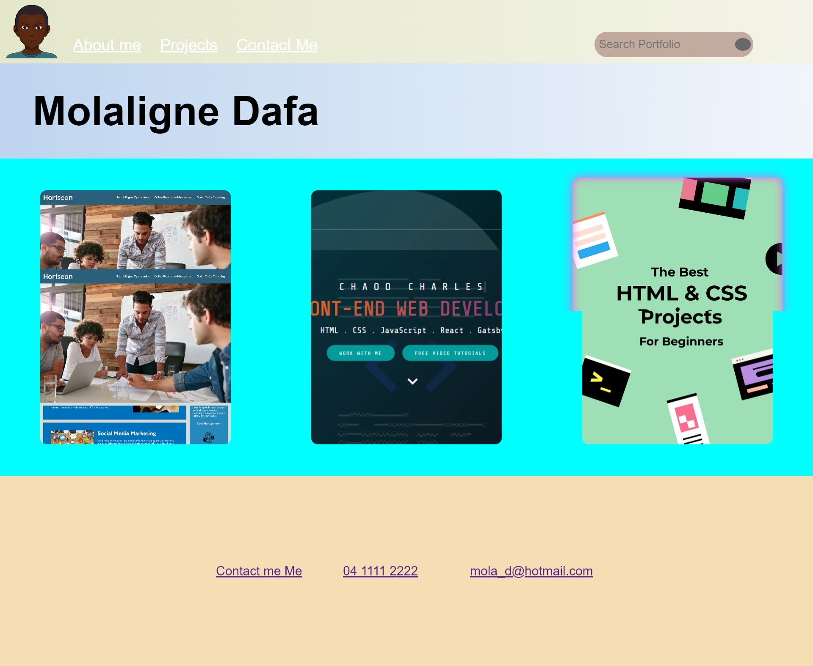

# ProjectOne

This is the Second project from the University of Adelaide's coding boot camp. The webpage is a portfolio webpage demonstrating some of my other works. 

## Table of Contents

- [Features](#features)
- [Link-to-Webpage](#Link-to-Webpage)
- [Appearance](#Appearance)
- [About-Developer](#About-developer)
- [Wireframe](#Wireframe)

## About-developer

Hi my name is Molaligne (Mola) Dafa. I am currently taking part in a coding boot camp and this is my Second project. 
In it, I have attempted to demonstrate my skills in CSS and HTML.

## Features

- Function nav bar.
- semantic HTML design.
- Accessible design features
- 
  
## Link-to-Webpage
- https://mola90.github.io/Portfolio-Webpage/

## Appearance

The following image demonstrates the webpage's appearance

## Wireframe
The following image displays a wireframe of my design

